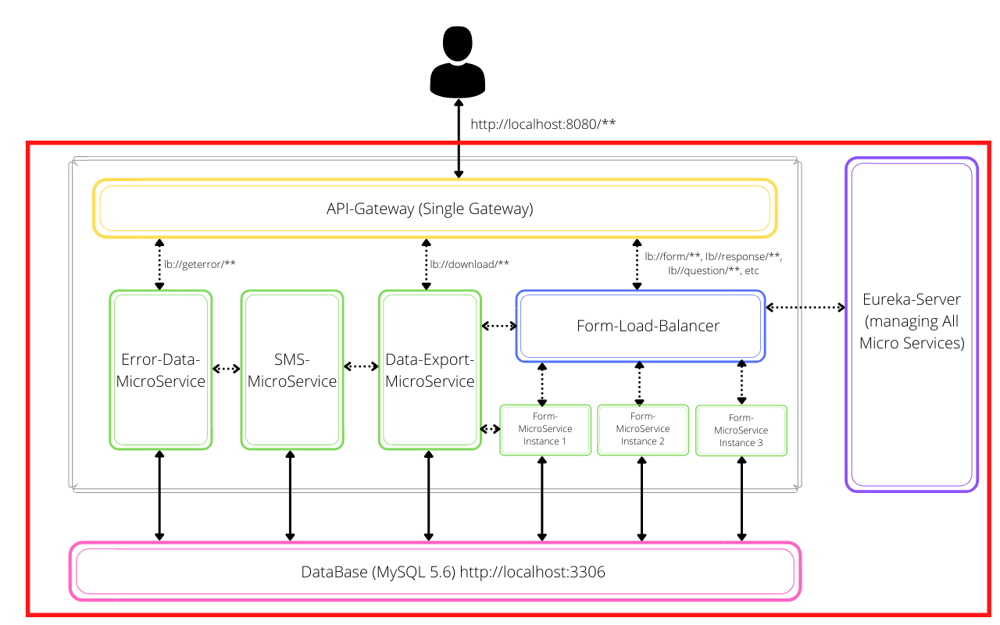
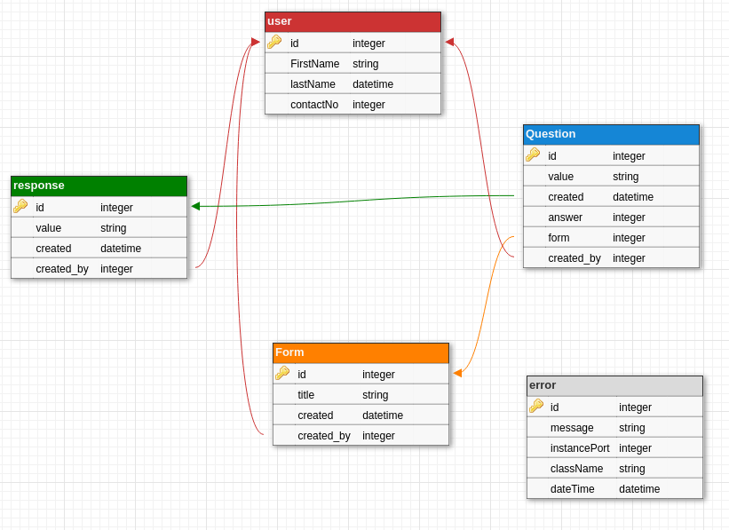
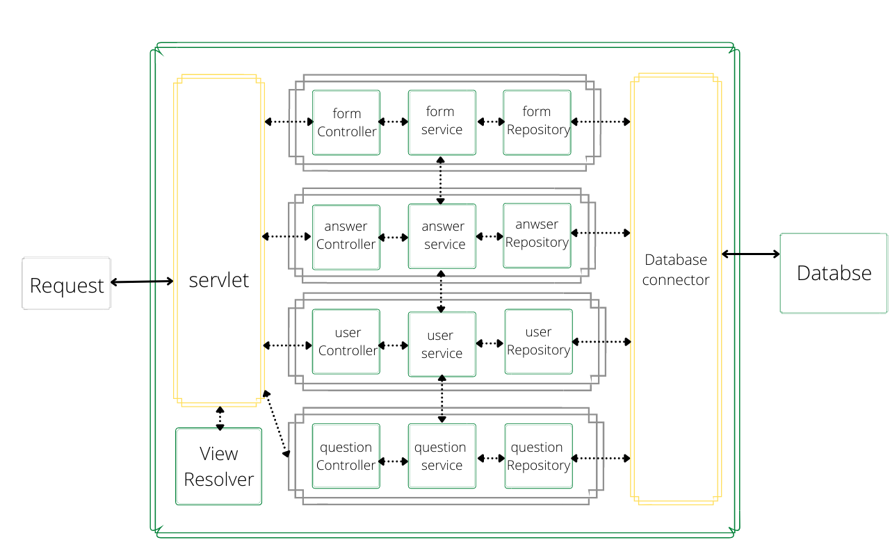

D-Track
============
D-Track is a backed project, where user can create a test and record the responces. The project primarily focused on maintaining the responses sent by the end user. This project will help us to understand how microservices work in Spring Framework.

Feature
------------
* CRUD operation support for Data Exchanges. 
* Microservice archtechture for handling different functionality.
* Horizontal scaling for Handling the bulk request. 
* Export the Database directly to the Google Sheet or download the complete information in CSV. 
* Send the SMS to the user when the response is successfully recorded. 
* Error-handling module to record every exception. 
* Single API gateway for every query.

Technology Stack
---------------
We used the Spring framework, Hibernate, eureka, MySQL for this project. In addition to the libraries, we used Lombok where feasible to avoid having to write so much repetitive code. 

Microservices
--------------
* APIGateway : This microservice is used to accept the request from the frontend and redirect the request to the other microservices. By using this, we can access our backend with a single public IP address and users need not worry about different services present inside the backend.
* Eureka Server : This server is used for managing all the microservices running on the system. Eureka knows about all the services currently running and their instance. It helps us in knowing the status of different services.
* Form Microservice : This microservice handles all the queries related to the Form, Response, Question, and answer. There are multiple instances running at the same time to support the load balancing. All the different instances which running on different ports are managed by the eureka server. We can add the new instance whenever we want and the eureka server discovery client gets registered automatically like in plug and plays fashion.
* Database Export Microservice : This microservice handles all the export-related works like Google-Sheet use case implementation and downloading the resources in CSV files. This microservice also uses Google Sheet API to create and upload the data to the sheet. For uploading the data to google sheet we need a credential.json file and a google account.
* Error Data Microservice : This microservice is used for recording all the error messages thrown by other microservices during uptime. It stores the location of the error produced along with the message in the database and can easily retrieve it via GET request for further study for the cause of failure. We can also add other rules of validation as project demand and add them to the table.
* SMS Microservice : This microservice handles SMS service. Whenever the response is recorded, the backend sends the SMS to the registered mobile number. I used the Twilio SMS API to send the SMS.
* Form Load Balancer : This server is used to redirect the request to the different form-microservices instances so that we can handle the bulk requests. There are different types of algorithms used to select which instance gets which request. Load-balancer solves the problem of over-requesting a single instance of service and divides the request into others.

System Design 
---------

Database
-------------

Design pattern
----------------

